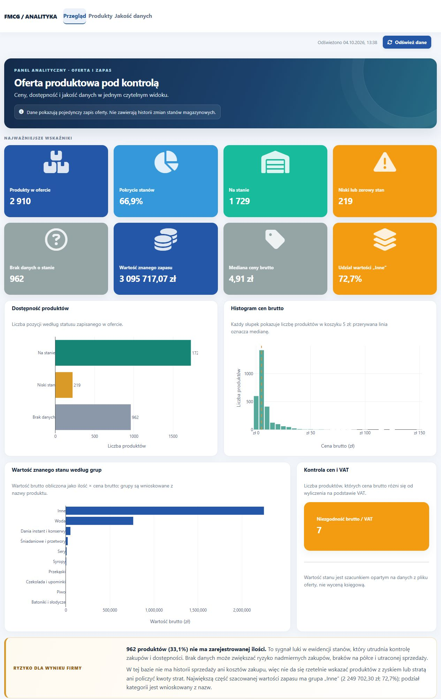
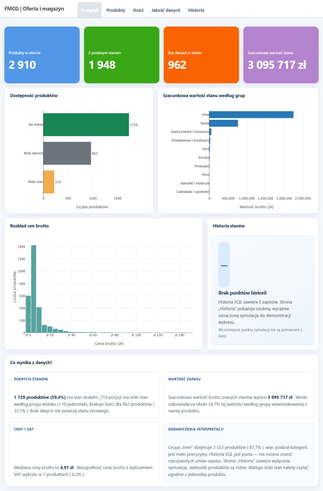
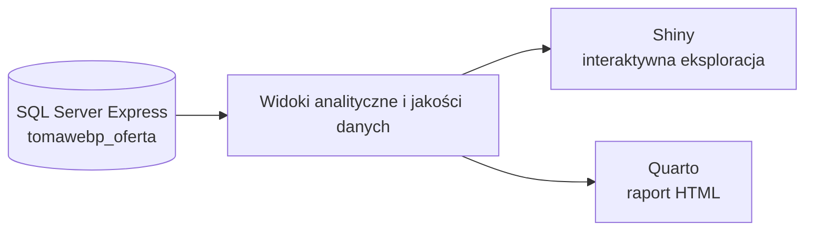

<div align="center">

# FMCG | Analiza oferty i widoczności zapasu

**FMCG product offer, inventory coverage and data-quality dashboard built with R Shiny, Quarto, SQL Server Express and T-SQL.**


**Dwa osobne interfejsy, jedno źródło danych:** interaktywny dashboard Shiny oraz raport Quarto renderowany do HTML.

</div>

## O projekcie

Projekt analizuje ofertę produktową FMCG pod kątem dostępności, jakości ewidencji, cen oraz orientacyjnej wartości znanych stanów. Łączy bazę Microsoft SQL Server Express z aplikacją R Shiny i raportem Quarto.

### Najważniejsze obserwacje

| Wskaźnik | Wynik z analizowanego wyciągu |
|---|---:|
| Produkty w ofercie | **2 910** |
| Brak zapisanej ilości | **962 (33,1%)** |
| Dodatni stan | **1 729 (59,4%)** |
| Niski stan według progu widoku | **219** |
| Szacunkowa wartość brutto znanego zapasu | **3 095 717 zł** |
| Udział grupy „Inne” w wartości zapasu | **72,7%** |

> **Zakres wniosku:** to pojedynczy obraz oferty. Brak ilości oznacza brak danych, nie potwierdzony stan zerowy. Wartość zapasu jest szacunkiem `ilość × cena brutto z oferty` — nie jest kosztem, przychodem ani zyskiem. Bez sprzedaży, kosztów zakupu i historii stanów nie da się rzetelnie obliczyć marży, rotacji ani strat firmy.

Grupy produktów są wnioskowane z nazw, dlatego wysoki udział „Inne” wskazuje przede wszystkim na potrzebę poprawy klasyfikacji. Próg niskiego stanu `<10` jest wspólny dla różnych jednostek i służy jako sygnał do sprawdzenia, nie jako rekomendacja zamówienia.

## Podgląd

<table>
  <tr>
    <td align="center" width="50%">
      <strong>Shiny · eksploracja i interakcje</strong><br>
      <a href="screenshots/shiny-dashboard.jpg"></a>
    </td>
    <td align="center" width="50%">
      <strong>Quarto · raport i narracja</strong><br>
      <a href="screenshots/quarto-dashboard.jpg"></a>
    </td>
  </tr>
</table>

## Jak działa



| Warstwa | Technologie | Rola |
|---|---|---|
| Baza danych | SQL Server Express, T-SQL | Dane oferty, widoki analityczne i reguły kontroli jakości |
| Aplikacja | R Shiny, Plotly, DT, bslib | Przegląd KPI, eksploracja katalogu i kontrola jakości |
| Raport | Quarto, R, Plotly | Renderowany raport HTML z interpretacją i ograniczeniami danych |
| Połączenie | DBI, ODBC Driver 18 | Odczyt danych z lokalnej bazy |

Shiny i Quarto są osobnymi aplikacjami. Mogą inaczej prezentować i udostępniać dane, zachowując wspólne źródło oraz znaczenie głównych miar.

## Uruchomienie

### Wymagania

- R oraz Quarto
- Microsoft SQL Server Express i ODBC Driver 18 for SQL Server
- Lokalna, autoryzowana baza `tomawebp_oferta` z widokami `dbo.vw_Oferta_Analytics` i `dbo.vw_Oferta_DataQualityIssues`

Domyślne połączenie używa `localhost\\SQLEXPRESS` i uwierzytelniania Windows. Można je zmienić zmiennymi środowiskowymi `MSSQL_SERVER`, `MSSQL_DATABASE` i `MSSQL_DRIVER`.

### Shiny

Z głównego katalogu repozytorium:

```r
install.packages(c("shiny", "bslib", "DBI", "odbc", "plotly", "DT"))
shiny::runApp("shiny")
```

### Quarto

```r
install.packages(c("knitr", "rmarkdown", "DBI", "odbc", "plotly", "DT"))
```

```sh
quarto render oferta_dashboard.qmd
```

## Struktura projektu

```text
database/                 schemat bazy, widoki i skrypty SQL
docs/                     raport zarządczy i opis wniosków
screenshots/              podglądy Shiny i Quarto
shiny/                    aplikacja R Shiny
oferta_dashboard.qmd      źródło raportu Quarto
styles.css                styl raportu Quarto
```

Więcej o interpretacji wyników: [raport zarządczy](docs/raport_zarzadczy.md).

## Granice analizy i prywatność

- Brak ilości, zero i nieprawidłowa ilość to różne stany danych.
- Jednostki `kg`, `op` i `szt` wymagają osobnej interpretacji.
- Historia stanów w bazie jest obecnie pusta. Wykres demonstracyjny w Quarto jest oznaczony jako symulacja i nie opisuje działalności firmy.
- Dane sprzedażowe i koszty zakupu są potrzebne do obliczenia marży, rotacji, dni zapasu oraz wyniku według produktu.
- Pełny zestaw danych źródłowych i wyrenderowany HTML pozostają lokalne; nie są częścią repozytorium.
- `database/00_create_database_and_load_data.sql` usuwa i odtwarza tabelę `dbo.Oferta`. Nie uruchamiaj go na bazie z danymi, które chcesz zachować.

